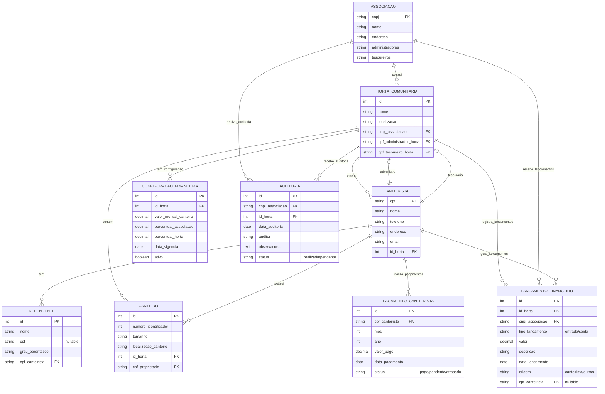

```mermaid
erDiagram
    ASSOCIACAO {
        string cnpj PK
        string nome
        string endereco
        string administradores
        string tesoureiros
    }
    
    HORTA_COMUNITARIA {
        int id PK
        string nome
        string localizacao
        string cnpj_associacao FK
        string cpf_administrador_horta FK
        string cpf_tesoureiro_horta FK
    }
    
    CANTEIRISTA {
        string cpf PK
        string nome
        string telefone
        string endereco
        string email
        int id_horta FK
    }
    
    DEPENDENTE {
        int id PK
        string nome
        string cpf "nullable"
        string grau_parentesco
        string cpf_canteirista FK
    }
    
    CANTEIRO {
        int id PK
        int numero_identificador
        string tamanho
        string localizacao_canteiro
        int id_horta FK
        string cpf_proprietario FK
    }
    
    CONFIGURACAO_FINANCEIRA {
        int id PK
        int id_horta FK
        decimal valor_mensal_canteiro
        decimal percentual_associacao
        decimal percentual_horta
        date data_vigencia
        boolean ativo
    }
    
    LANCAMENTO_FINANCEIRO {
        int id PK
        int id_horta FK
        string cnpj_associacao FK
        string tipo_lancamento "entrada/saida"
        decimal valor
        string descricao
        date data_lancamento
        string origem "canteirista/outros"
        string cpf_canteirista FK "nullable"
    }
    
    PAGAMENTO_CANTEIRISTA {
        int id PK
        string cpf_canteirista FK
        int mes
        int ano
        decimal valor_pago
        date data_pagamento
        string status "pago/pendente/atrasado"
    }
    
    AUDITORIA {
        int id PK
        string cnpj_associacao FK
        int id_horta FK
        date data_auditoria
        string auditor
        text observacoes
        string status "realizada/pendente"
    }

    %% Relacionamentos principais
    ASSOCIACAO ||--o{ HORTA_COMUNITARIA : "possui"
    HORTA_COMUNITARIA ||--o{ CANTEIRISTA : "vincula"
    CANTEIRISTA ||--o{ DEPENDENTE : "tem"
    HORTA_COMUNITARIA ||--o{ CANTEIRO : "contem"
    CANTEIRISTA ||--o{ CANTEIRO : "possui"
    
    %% Relacionamentos financeiros
    HORTA_COMUNITARIA ||--o{ CONFIGURACAO_FINANCEIRA : "tem_configuracao"
    HORTA_COMUNITARIA ||--o{ LANCAMENTO_FINANCEIRO : "registra_lancamentos"
    ASSOCIACAO ||--o{ LANCAMENTO_FINANCEIRO : "recebe_lancamentos"
    CANTEIRISTA ||--o{ PAGAMENTO_CANTEIRISTA : "realiza_pagamentos"
    CANTEIRISTA ||--o{ LANCAMENTO_FINANCEIRO : "gera_lancamentos"
    
    %% Relacionamentos de administração
    CANTEIRISTA ||--o| HORTA_COMUNITARIA : "administra"
    CANTEIRISTA ||--o| HORTA_COMUNITARIA : "tesouraria"
    
    %% Relacionamentos de auditoria
    ASSOCIACAO ||--o{ AUDITORIA : "realiza_auditoria"
    HORTA_COMUNITARIA ||--o{ AUDITORIA : "recebe_auditoria"
```
