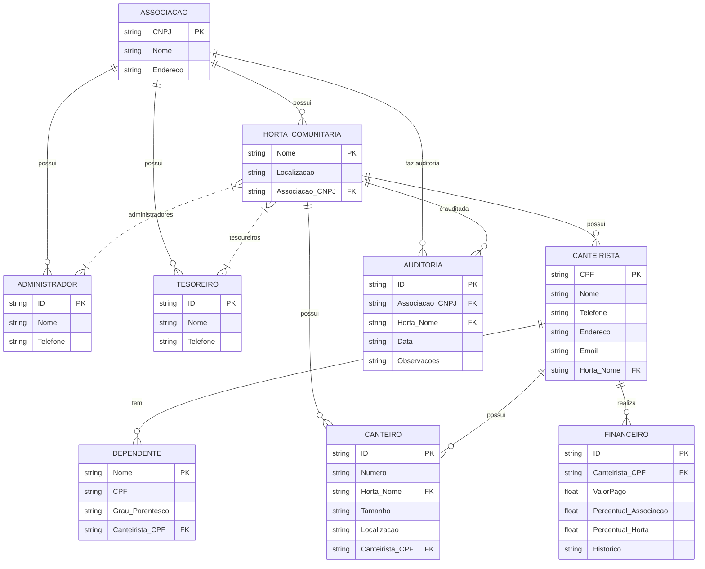

```mermaid
erDiagram
    ASSOCIACAO {
        string CNPJ PK
        string Nome
        string Endereco
    }
    HORTA_COMUNITARIA {
        string Nome PK
        string Localizacao
        string Associacao_CNPJ FK
    }
    ADMINISTRADOR {
        string ID PK
        string Nome
        string Telefone
    }
    TESOREIRO {
        string ID PK
        string Nome
        string Telefone
    }
    CANTEIRISTA {
        string CPF PK
        string Nome
        string Telefone
        string Endereco
        string Email
        string Horta_Nome FK
    }
    DEPENDENTE {
        string Nome PK
        string CPF
        string Grau_Parentesco
        string Canteirista_CPF FK
    }
    CANTEIRO {
        string ID PK
        string Numero
        string Horta_Nome FK
        string Tamanho
        string Localizacao
        string Canteirista_CPF FK
    }
    FINANCEIRO {
        string ID PK
        string Canteirista_CPF FK
        float ValorPago
        float Percentual_Associacao
        float Percentual_Horta
        string Historico
    }
    AUDITORIA {
        string ID PK
        string Associacao_CNPJ FK
        string Horta_Nome FK
        string Data
        string Observacoes
    }

    ASSOCIACAO ||--o{ HORTA_COMUNITARIA : possui
    ASSOCIACAO ||--o{ ADMINISTRADOR : possui
    ASSOCIACAO ||--o{ TESOREIRO : possui

    HORTA_COMUNITARIA }|..|{ ADMINISTRADOR : "administradores"
    HORTA_COMUNITARIA }|..|{ TESOREIRO : "tesoureiros"
    HORTA_COMUNITARIA ||--o{ CANTEIRISTA : "possui"
    HORTA_COMUNITARIA ||--o{ CANTEIRO : "possui"

    CANTEIRISTA ||--o{ DEPENDENTE : "tem"
    CANTEIRISTA ||--o{ CANTEIRO : "possui"
    CANTEIRISTA ||--o{ FINANCEIRO : "realiza"

    ASSOCIACAO ||--o{ AUDITORIA : "faz auditoria"
    HORTA_COMUNITARIA ||--o{ AUDITORIA : "é auditada"
```
